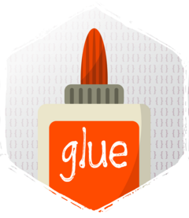

<!-- README.md is generated from README.Rmd. Please edit that file -->

# glue <a href='https://glue.tidyverse.org'></a>

<!-- badges: start -->

[](https://cran.r-project.org/package=glue)
[](https://github.com/tidyverse/glue/actions/workflows/R-CMD-check.yaml)
[](https://github.com/tidyverse/glue/actions/workflows/test-coverage.yaml)
<!-- badges: end -->

## Overview

Glue offers interpreted string literals that are small, fast, and
dependency-free. Glue does this by embedding R expressions in curly
braces which are then evaluated and inserted into the argument string.

## Installation

<div class=".pkgdown-release">

``` r
# Install released version from CRAN
install.packages("glue")
```

</div>

<div class=".pkgdown-devel">

``` r
# Install development version from GitHub
devtools::install_github("tidyverse/glue")
```

</div>

## Usage

##### Variables can be passed directly into strings.

``` r
library(glue)
name <- "Fred"
glue('My name is {name}.')
#> My name is Fred.
```

Note that `glue::glue()` is also made available via
`stringr::str_glue()`. So if you’ve already attached stringr (or perhaps
the whole tidyverse), you can access `glue()` like so:

``` r
library(stringr) # or library(tidyverse)

stringr_fcn <- "`stringr::str_glue()`"
glue_fcn    <- "`glue::glue()`"

str_glue('{stringr_fcn} is essentially an alias for {glue_fcn}.')
#> `stringr::str_glue()` is essentially an alias for `glue::glue()`.
```

##### Long strings are broken by line and concatenated together.

``` r
library(glue)

name <- "Fred"
age <- 50
anniversary <- as.Date("1991-10-12")
glue('My name is {name},',
  ' my age next year is {age + 1},',
  ' my anniversary is {format(anniversary, "%A, %B %d, %Y")}.')
#> My name is Fred, my age next year is 51, my anniversary is Saturday, October 12, 1991.
```

##### Named arguments are used to assign temporary variables.

``` r
glue('My name is {name},',
  ' my age next year is {age + 1},',
  ' my anniversary is {format(anniversary, "%A, %B %d, %Y")}.',
  name = "Joe",
  age = 40,
  anniversary = as.Date("2001-10-12"))
#> My name is Joe, my age next year is 41, my anniversary is Friday, October 12, 2001.
```

##### `glue_data()` is useful with [magrittr](https://cran.r-project.org/package=magrittr) pipes.

``` r
`%>%` <- magrittr::`%>%`
head(mtcars) %>% glue_data("{rownames(.)} has {hp} hp")
#> Mazda RX4 has 110 hp
#> Mazda RX4 Wag has 110 hp
#> Datsun 710 has 93 hp
#> Hornet 4 Drive has 110 hp
#> Hornet Sportabout has 175 hp
#> Valiant has 105 hp
```

##### Or within dplyr pipelines

``` r
library(dplyr)
head(iris) %>%
  mutate(description = glue("This {Species} has a petal length of {Petal.Length}"))
#>   Sepal.Length Sepal.Width Petal.Length Petal.Width Species
#> 1          5.1         3.5          1.4         0.2  setosa
#> 2          4.9         3.0          1.4         0.2  setosa
#> 3          4.7         3.2          1.3         0.2  setosa
#> 4          4.6         3.1          1.5         0.2  setosa
#> 5          5.0         3.6          1.4         0.2  setosa
#> 6          5.4         3.9          1.7         0.4  setosa
#>                             description
#> 1 This setosa has a petal length of 1.4
#> 2 This setosa has a petal length of 1.4
#> 3 This setosa has a petal length of 1.3
#> 4 This setosa has a petal length of 1.5
#> 5 This setosa has a petal length of 1.4
#> 6 This setosa has a petal length of 1.7
```

##### Leading whitespace and blank lines from the first and last lines are automatically trimmed.

This lets you indent the strings naturally in code.

``` r
glue("
    A formatted string
    Can have multiple lines
      with additional indention preserved
    ")
#> A formatted string
#> Can have multiple lines
#>   with additional indention preserved
```

##### An additional newline can be used if you want a leading or trailing newline.

``` r
glue("

  leading or trailing newlines can be added explicitly

  ")
#> 
#> leading or trailing newlines can be added explicitly
```

##### `\\` at the end of a line continues it without a new line.

``` r
glue("
    A formatted string \\
    can also be on a \\
    single line
    ")
#> A formatted string can also be on a single line
```

##### A literal brace is inserted by using doubled braces.

``` r
name <- "Fred"
glue("My name is {name}, not {{name}}.")
#> My name is Fred, not {name}.
```

##### Alternative delimiters can be specified with `.open` and `.close`.

``` r
one <- "1"
glue("The value of $e^{2\\pi i}$ is $<<one>>$.", .open = "<<", .close = ">>")
#> The value of $e^{2\pi i}$ is $1$.
```

##### All valid R code works in expressions, including braces and escaping.

Backslashes do need to be doubled just like in all R strings.

``` r
  `foo}\`` <- "foo"
glue("{
      {
        '}\\'' # { and } in comments, single quotes
        \"}\\\"\" # or double quotes are ignored
        `foo}\\`` # as are { in backticks
      }
  }")
#> foo
```

##### `glue_sql()` makes constructing SQL statements safe and easy

Use backticks to quote identifiers, normal strings and numbers are
quoted appropriately for your backend.

``` r
library(glue)

con <- DBI::dbConnect(RSQLite::SQLite(), ":memory:")
colnames(iris) <- gsub("[.]", "_", tolower(colnames(iris)))
DBI::dbWriteTable(con, "iris", iris)
var <- "sepal_width"
tbl <- "iris"
num <- 2
val <- "setosa"
glue_sql("
  SELECT {`var`}
  FROM {`tbl`}
  WHERE {`tbl`}.sepal_length > {num}
    AND {`tbl`}.species = {val}
  ", .con = con)
#> <SQL> SELECT `sepal_width`
#> FROM `iris`
#> WHERE `iris`.sepal_length > 2
#>   AND `iris`.species = 'setosa'

# `glue_sql()` can be used in conjunction with parameterized queries using
# `DBI::dbBind()` to provide protection for SQL Injection attacks
 sql <- glue_sql("
    SELECT {`var`}
    FROM {`tbl`}
    WHERE {`tbl`}.sepal_length > ?
  ", .con = con)
query <- DBI::dbSendQuery(con, sql)
DBI::dbBind(query, list(num))
DBI::dbFetch(query, n = 4)
#>   sepal_width
#> 1         3.5
#> 2         3.0
#> 3         3.2
#> 4         3.1
DBI::dbClearResult(query)

# `glue_sql()` can be used to build up more complex queries with
# interchangeable sub queries. It returns `DBI::SQL()` objects which are
# properly protected from quoting.
sub_query <- glue_sql("
  SELECT *
  FROM {`tbl`}
  ", .con = con)

glue_sql("
  SELECT s.{`var`}
  FROM ({sub_query}) AS s
  ", .con = con)
#> <SQL> SELECT s.`sepal_width`
#> FROM (SELECT *
#> FROM `iris`) AS s

# If you want to input multiple values for use in SQL IN statements put `*`
# at the end of the value and the values will be collapsed and quoted appropriately.
glue_sql("SELECT * FROM {`tbl`} WHERE sepal_length IN ({vals*})",
  vals = 1, .con = con)
#> <SQL> SELECT * FROM `iris` WHERE sepal_length IN (1)

glue_sql("SELECT * FROM {`tbl`} WHERE sepal_length IN ({vals*})",
  vals = 1:5, .con = con)
#> <SQL> SELECT * FROM `iris` WHERE sepal_length IN (1, 2, 3, 4, 5)

glue_sql("SELECT * FROM {`tbl`} WHERE species IN ({vals*})",
  vals = "setosa", .con = con)
#> <SQL> SELECT * FROM `iris` WHERE species IN ('setosa')

glue_sql("SELECT * FROM {`tbl`} WHERE species IN ({vals*})",
  vals = c("setosa", "versicolor"), .con = con)
#> <SQL> SELECT * FROM `iris` WHERE species IN ('setosa', 'versicolor')
```

##### Optionally combine strings with `+`

``` r
x <- 1
y <- 3
glue("x + y") + " = {x + y}"
#> x + y = 4
```

# Other implementations

Some other implementations of string interpolation in R (although not
using identical syntax).

-   [stringr::str_interp](https://stringr.tidyverse.org/reference/str_interp.html)
-   [R.utils::gstring](https://cran.r-project.org/package=R.utils)
-   [rprintf](https://cran.r-project.org/package=rprintf)

String templating is closely related to string interpolation, although
not exactly the same concept. Some packages implementing string
templating in R include.

-   [whisker](https://cran.r-project.org/package=whisker)
-   [brew](https://cran.r-project.org/package=brew)

## Code of Conduct

Please note that the glue project is released with a [Contributor Code
of Conduct](https://glue.tidyverse.org/CODE_OF_CONDUCT.html). By
contributing to this project, you agree to abide by its terms.
